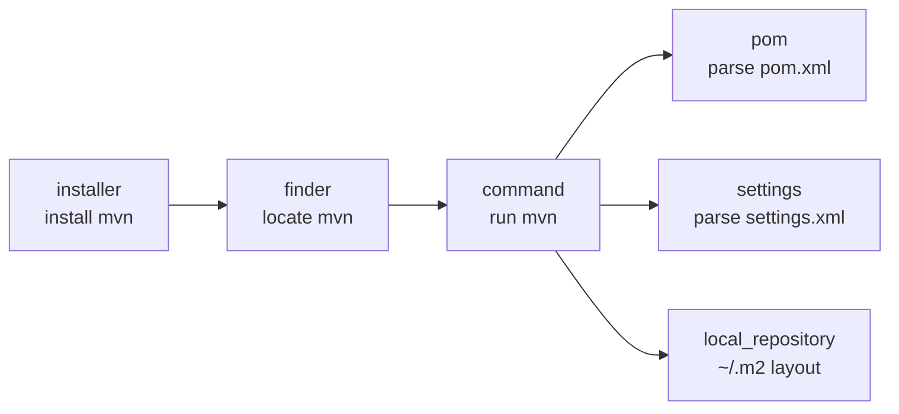
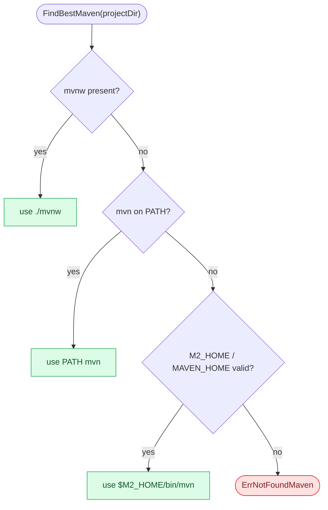
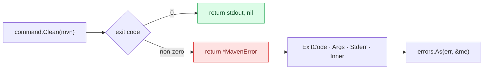
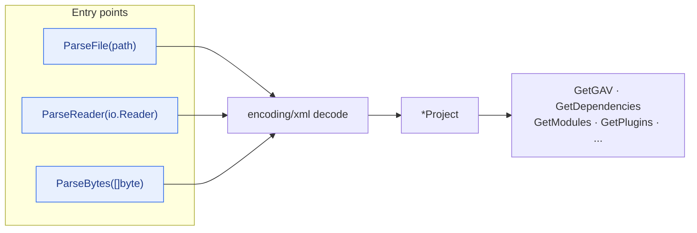
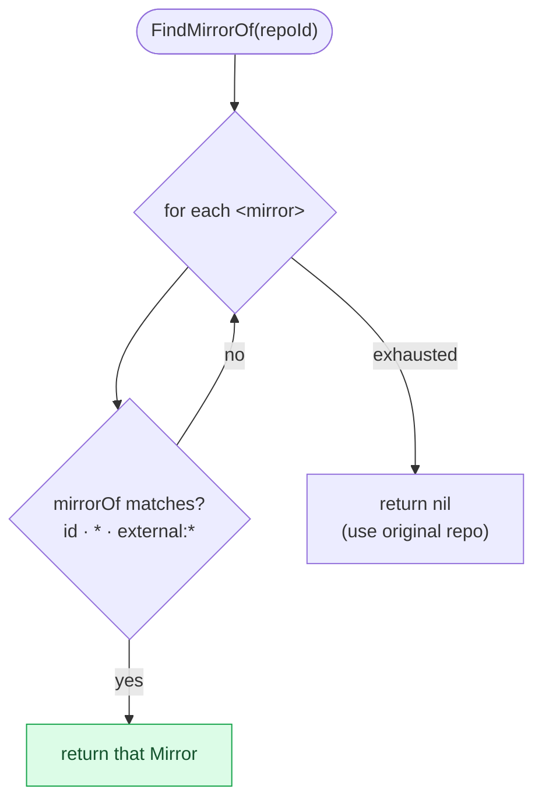
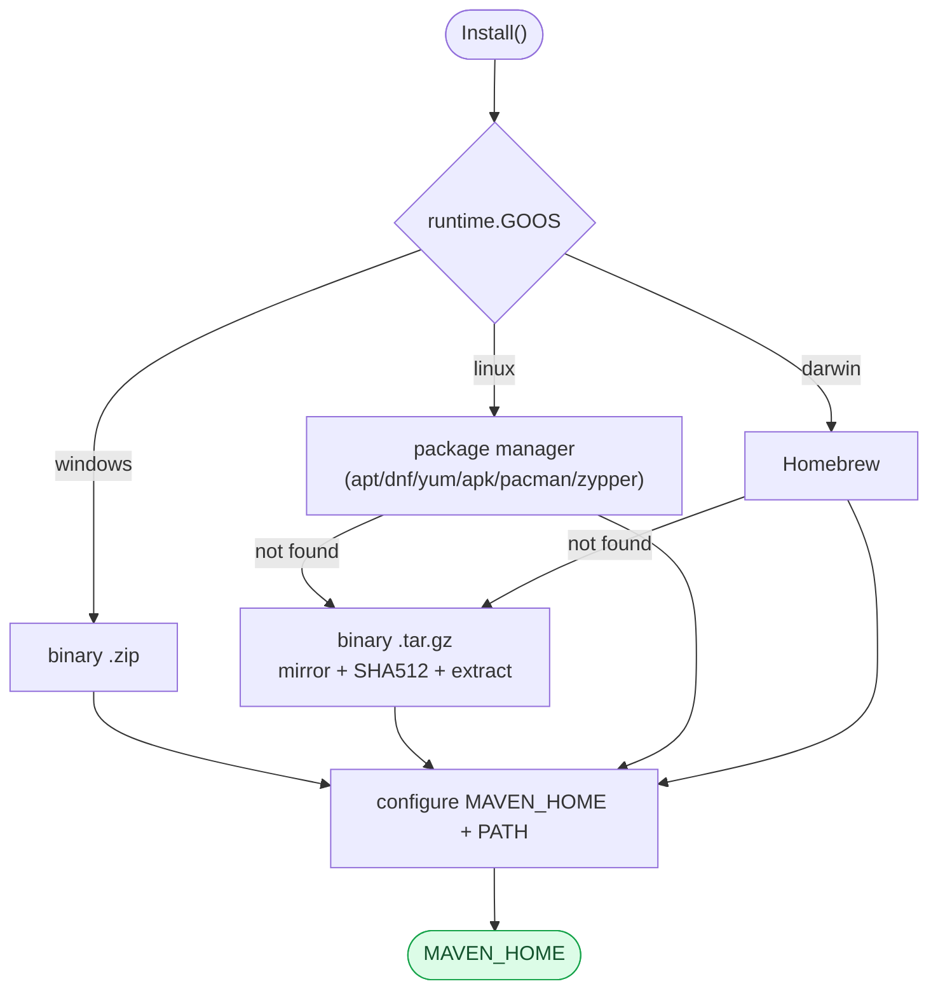

# API Reference

This document provides detailed API reference for Maven SDK Go. For the bigger
picture — how these packages interact and how a build request flows through the
system — see the [Architecture](/architecture) guide.

## Package Map



## Package Overview

### Finder

The Finder package locates Maven executables, including system Maven and Maven Wrapper.

```go
package finder

// FindMaven finds a locally-installed Maven executable (PATH / M2_HOME / MAVEN_HOME)
func FindMaven() (string, error)

// Check validates a directory contains a valid Maven installation
func Check(mavenHomeDirectory string) bool

// FindMavenWrapper finds Maven Wrapper (mvnw/mvnw.cmd) in a project directory
func FindMavenWrapper(projectDir string) (string, error)

// FindBestMaven finds the best Maven: prefers project Wrapper, falls back to system Maven
func FindBestMaven(projectDir string) (string, error)

// HasMavenWrapper checks if a project directory contains Maven Wrapper
func HasMavenWrapper(projectDir string) bool

var ErrNotFoundMaven error
var ErrNotFoundMavenWrapper error
```

**Resolution order** used by `FindBestMaven` — the project wrapper is preferred
because it pins the exact Maven version the project expects:



### Command

The Command package provides comprehensive Maven command execution.

#### Command Builder (Recommended)

The builder pattern provides a fluent, composable API for constructing Maven commands:

```go
package command

// Create a builder with common CI settings
output, err := NewCommandBuilder().
    WithExecutable("mvn").
    WithWorkingDirectory("/path/to/project").
    WithBatchMode().           // -B: non-interactive mode for CI
    WithNoTransferProgress().  // -ntp: cleaner CI logs
    WithProfiles("ci").        // -P ci
    WithSkipTests().           // -DskipTests
    WithUpdateSnapshots().     // -U
    Clean()                    // executes "mvn -B -ntp -P ci -DskipTests -U clean"
```

**Builder Options:**

| Method | CLI Flag | Description |
|--------|----------|-------------|
| `WithExecutable(path)` | — | Set mvn executable path |
| `WithWorkingDirectory(dir)` | — | Set working directory |
| `WithPomFile(path)` | `-f` | Specify POM file |
| `WithSettingsFile(path)` | `-s` | Specify user settings.xml |
| `WithGlobalSettings(path)` | `-gs` | Specify global settings.xml |
| `WithToolchains(path)` | `-t` | Specify toolchains file |
| `WithProfiles(...)` | `-P` | Activate profiles |
| `WithProperty(k, v)` | `-Dk=v` | Set system property |
| `WithProperties(map)` | `-Dk=v` | Set multiple properties |
| `WithProjects(...)` | `-pl` | Build specific modules |
| `WithAlsoMake()` | `-am` | Also build dependencies |
| `WithAlsoMakeDependents()` | `-amd` | Also build dependents |
| `WithOffline()` | `-o` | Offline mode |
| `WithBatchMode()` | `-B` | Non-interactive mode |
| `WithUpdateSnapshots()` | `-U` | Force update snapshots |
| `WithSkipTests()` | `-DskipTests` | Skip test execution |
| `WithSkipTestsCompletely()` | `-Dmaven.test.skip=true` | Skip test compilation & execution |
| `WithErrors()` | `-e` | Show full error stack traces |
| `WithDebug()` | `-X` | Debug output |
| `WithQuiet()` | `-q` | Quiet mode |
| `WithThreads(n)` | `-T n` | Parallel builds |
| `WithNonRecursive()` | `-N` | Don't recurse into submodules |
| `WithResumeFrom(module)` | `-rf` | Resume build from module |
| `WithFailAtEnd()` | `-fae` | Continue on failure, fail at end |
| `WithFailNever()` | `-fn` | Never fail |
| `WithFailFast()` | `-ff` | Fail fast (default) |
| `WithNoTransferProgress()` | `-ntp` | Suppress download progress |
| `WithStrictChecksums()` | `-C` | Fail on checksum mismatch |
| `WithLaxChecksums()` | `-c` | Warn on checksum mismatch |
| `WithShowVersion()` | `-V` | Show version without stopping |

**Builder Convenience Methods:** `Clean()`, `Compile()`, `Test()`, `Package()`, `Install()`, `Deploy()`, `Verify()`

> **Immutability:** Convenience methods do NOT mutate the builder. Each call creates a copy
> with the additional goal, so the original builder remains reusable for subsequent calls.

#### Error Handling

Every failure surfaces as a typed `*MavenError` carrying the exit code, the full
argv, and Maven's stderr — so callers can branch on the exit code instead of
grepping strings.



```go
// MavenError represents a failed Maven command execution
type MavenError struct {
    Command   string   // The full command (e.g. "mvn clean install")
    Args      []string // Command arguments
    Stderr    string   // Maven's stderr output (truncated to 500 chars)
    ExitCode  int      // Process exit code (if available)
    Inner     error    // The original error
}

// ExecForStdout returns *MavenError when the command fails, including stderr content
output, err := command.Clean("mvn")
if err != nil {
    var me *command.MavenError
    if errors.As(err, &me) {
        log.Printf("Maven stderr: %s", me.Stderr)
    }
}
```

#### Generic Execution

```go
// Options holds command execution configuration
type Options struct {
    Executable       string
    Args             []string
    WorkingDirectory string
    Stdin            io.Reader
    Stdout           io.Writer
    Stderr           io.Writer
}

// Exec executes a Maven command with options
func Exec(options *Options) error

// ExecForStdout executes and returns stdout
func ExecForStdout(executable string, args ...string) (string, error)

// BuildExecutable constructs mvn path from MAVEN_HOME
func BuildExecutable(mavenHomeDirectory string) string
```

#### Lifecycle Phases

Invoking a phase runs it **and every earlier phase** in the same lifecycle. The
functions below are thin wrappers over `mvn <phase>`.


```go
// Standard phases
func Clean(executable string) (string, error)          // mvn clean
func Compile(executable string) (string, error)         // mvn compile
func Test(executable string) (string, error)            // mvn test
func TestCompile(executable string) (string, error)     // mvn test-compile
func Package(executable string) (string, error)         // mvn package
func Verify(executable string) (string, error)          // mvn verify
func Deploy(executable string) (string, error)          // mvn deploy
func Site(executable string) (string, error)            // mvn site
func Validate(executable string) (string, error)        // mvn validate
func Install(executable string) (string, error)         // mvn clean install
func StandaloneInstall(executable string) (string, error) // mvn install (no clean)

// Extended phases
func Initialize(executable string) (string, error)           // mvn initialize
func GenerateSources(executable string) (string, error)      // mvn generate-sources
func ProcessResources(executable string) (string, error)     // mvn process-resources
func PreparePackage(executable string) (string, error)       // mvn prepare-package
func PreIntegrationTest(executable string) (string, error)   // mvn pre-integration-test
func IntegrationTest(executable string) (string, error)      // mvn integration-test
func PostIntegrationTest(executable string) (string, error)  // mvn post-integration-test
func PreClean(executable string) (string, error)             // mvn pre-clean
func PostClean(executable string) (string, error)            // mvn post-clean
func PreSite(executable string) (string, error)              // mvn pre-site
func PostSite(executable string) (string, error)             // mvn post-site
func SiteDeploy(executable string) (string, error)           // mvn site-deploy
```

#### Dependency Commands

```go
func DependencyGet(executable, groupId, artifactId, version string) (string, error)  // mvn dependency:get
func DependencyTree(executable string) (string, error)                               // mvn dependency:tree
func DependencyResolve(executable string) (string, error)                            // mvn dependency:resolve
func DependencyAnalyze(executable string) (string, error)                            // mvn dependency:analyze
func DependencyList(executable string) (string, error)                               // mvn dependency:list
func DependencyPurgeLocalRepository(executable string) (string, error)               // mvn dependency:purge-local-repository
func DependencyCopy(executable, gid, aid, ver, outputDir string) (string, error)     // mvn dependency:copy
func DependencyCopyDependencies(executable, outputDir string) (string, error)        // mvn dependency:copy-dependencies
func DependencyUnpack(executable, gid, aid, ver, outputDir string) (string, error)   // mvn dependency:unpack
func DependencyBuildClasspath(executable string) (string, error)                     // mvn dependency:build-classpath
```

#### Help Commands

```go
func Version(executable string) (string, error)                    // mvn -v
func GetLocalRepositoryDirectory(executable string) (string, error) // mvn help:evaluate
func EffectivePom(executable string) (string, error)               // mvn help:effective-pom
func EffectiveSettings(executable string) (string, error)           // mvn help:effective-settings
func ActiveProfiles(executable string) (string, error)              // mvn help:active-profiles
func DescribePlugin(executable, plugin string) (string, error)     // mvn help:describe
```

#### Testing Plugins

```go
// Surefire (unit tests)
func SurefireTest(executable string) (string, error)                        // mvn surefire:test
func SurefireTestSingleClass(executable, className string) (string, error)  // mvn surefire:test -Dtest=...
func SurefireTestMethod(executable, methodSpec string) (string, error)      // mvn surefire:test -Dtest=Class#method

// Failsafe (integration tests)
func FailsafeIntegrationTest(executable string) (string, error)  // mvn failsafe:integration-test
func FailsafeVerify(executable string) (string, error)           // mvn failsafe:verify
```

#### Version Management

```go
func VersionsSet(executable, newVersion string) (string, error)               // mvn versions:set
func VersionsCommit(executable string) (string, error)                        // mvn versions:commit
func VersionsRevert(executable string) (string, error)                        // mvn versions:revert
func VersionsDisplayDependencyUpdates(executable string) (string, error)      // mvn versions:display-dependency-updates
func VersionsDisplayPluginUpdates(executable string) (string, error)          // mvn versions:display-plugin-updates
func VersionsUseLatestReleases(executable string) (string, error)             // mvn versions:use-latest-releases
func VersionsUseNextReleases(executable string) (string, error)               // mvn versions:use-next-releases
```

#### Release

```go
func ReleasePrepare(executable string) (string, error)                    // mvn release:prepare
func ReleasePrepareWithArgs(executable string, args ...string) (string, error)
func ReleasePerform(executable string) (string, error)                    // mvn release:perform
func ReleaseRollback(executable string) (string, error)                   // mvn release:rollback
func ReleaseClean(executable string) (string, error)                      // mvn release:clean
```

#### Artifact Packaging & Publishing

```go
func JarJar(executable string) (string, error)                // mvn jar:jar
func SourceJar(executable string) (string, error)             // mvn source:jar
func SourceJarNoFork(executable string) (string, error)       // mvn source:jar-no-fork
func JavadocJavadoc(executable string) (string, error)        // mvn javadoc:javadoc
func JavadocJar(executable string) (string, error)            // mvn javadoc:jar
func InstallJar(executable, jarPath, gid, aid, ver string) (string, error) // mvn install:install-file
func DeployDeploy(executable string) (string, error)          // mvn deploy:deploy
func DeployDeployFile(executable, file, gid, aid, ver, repoId, url string) (string, error) // mvn deploy:deploy-file
func GpgSign(executable string) (string, error)               // mvn gpg:sign
```

#### Build Tools

```go
func AssemblySingle(executable string) (string, error)        // mvn assembly:single
func ShadeShade(executable string) (string, error)            // mvn shade:shade
func ExecJava(executable string) (string, error)              // mvn exec:java
func ExecJavaWithMainClass(executable, mainClass string) (string, error)
func ExecExec(executable string) (string, error)              // mvn exec:exec
func EnforcerEnforce(executable string) (string, error)       // mvn enforcer:enforce
func ArchetypeCreate(executable, dir, gid, aid, ver string) (string, error) // mvn archetype:generate
func Wrapper(executable string) (string, error)               // mvn wrapper:wrapper
```

### POM Parser

The POM package parses Maven `pom.xml` files into typed Go structs. All three
entry points funnel into the same XML decoder, so behaviour is identical whether
you start from a path, a reader, or a byte slice.



See the [Architecture guide](/architecture#pom-object-model) for the full
`Project` object model as a class diagram.

```go
package pom

// Parse from various sources
func ParseFile(path string) (*Project, error)
func ParseReader(r io.Reader) (*Project, error)
func ParseBytes(data []byte) (*Project, error)

// Project methods
func (p *Project) GetGAV() (groupId, artifactId, version string)
func (p *Project) GetDependencies() []Dependency
func (p *Project) GetModules() []string
func (p *Project) GetPlugins() []Plugin
func (p *Project) GetProfiles() []Profile
func (p *Project) GetRepositories() []Repository
func (p *Project) GetProperties() map[string]string
func (p *Project) GetLicenses() []License
func (p *Project) GetDevelopers() []Developer
func (p *Project) GetScm() *Scm
func (p *Project) GetBuild() *Build
func (p *Project) GetPackaging() string  // defaults to "jar" if not specified
func (p *Project) IsMultiModule() bool
func (p *Project) HasParent() bool
func (p *Project) FindDependency(groupId, artifactId string) *Dependency
func (p *Project) FindPlugin(groupId, artifactId string) *Plugin
```

**Key Types:** `Project`, `Parent`, `Dependency`, `Plugin`, `Profile`, `Repository`, `Build`, `Scm`, `License`, `Developer`

### Settings Parser

The Settings package parses Maven `settings.xml` files. `FindMirrorOf` implements
Maven's mirror-matching rules, including the `*` and `external:*` wildcards.



```go
package settings

// Parse from various sources
func ParseFile(path string) (*Settings, error)
func ParseReader(r io.Reader) (*Settings, error)
func ParseBytes(data []byte) (*Settings, error)
func ParseDefault() (*Settings, error)   // Parse ~/.m2/settings.xml or ${M2_HOME}/conf/settings.xml

// Utility
func GetDefaultSettingsPath() string     // Returns ~/.m2/settings.xml path

// Settings methods
func (s *Settings) GetMirrors() []Mirror
func (s *Settings) GetServers() []Server
func (s *Settings) GetProxies() []Proxy
func (s *Settings) GetProfiles() []SettingsProfile
func (s *Settings) GetActiveProfileIds() []string
func (s *Settings) GetPluginGroups() []string
func (s *Settings) GetLocalRepository() string
func (s *Settings) IsOffline() bool
func (s *Settings) FindServer(id string) *Server
func (s *Settings) FindMirror(id string) *Mirror
func (s *Settings) FindMirrorOf(repositoryId string) *Mirror
func (s *Settings) FindActiveProxy() *Proxy
func (s *Settings) FindProfile(id string) *SettingsProfile
```

**Key Types:** `Settings`, `Server`, `Mirror`, `Proxy`, `SettingsProfile`, `SettingsActivation`

### Local Repository

```go
package local_repository

var DefaultLocalRepositoryDirectory string  // ~/.m2/repository/

func ParseLocalRepositoryDirectory(executable string) string
func BuildDirectory(groupId, artifactId, version string) string
func FindDirectory(repoDir, groupId, artifactId, version string) (string, error)
func FindJar(repoDir, groupId, artifactId, version string) (string, error)
func FindJarWithClassifier(repoDir, groupId, artifactId, version, classifier string) (string, error)
```

### Installer

`Install()` auto-detects the platform and picks the cheapest viable strategy;
`InstallWithOptions` exposes version pinning, custom mirrors, checksum control,
and idempotency overrides. See the [Architecture guide](/architecture#installer-end-to-end-flow)
for the complete flow, mirror-fallback sequence, and per-OS environment handling.



```go
package installer

// High-level entry points
func Install() (string, error)              // Auto-detect platform, idempotent
func InstallLinux() (string, error)         // apt/dnf/yum/apk/pacman/zypper or binary
func InstallMacOS() (string, error)         // Homebrew or binary
func InstallWindows() (string, error)       // zip + safe PATH/MAVEN_HOME setup

// Configurable entry point
func InstallWithOptions(opts InstallOptions) (string, error)
func DefaultInstallOptions() InstallOptions
func InstallMacOSWithOptions(opts InstallOptions) (string, error) // legacy alias

// Options
type InstallOptions struct {
    Version      string   // "" → DefaultMavenVersion
    Mirrors      []string // "" → DefaultMirrors (Apache + Aliyun + Tsinghua)
    HomeDir      string   // install target (default: OS-specific)
    SkipEnvSetup bool     // don't touch PATH / shell rc
    SkipChecksum bool     // skip SHA512 verification (not recommended)
    Force        bool     // reinstall even if a usable Maven exists
    MaxRetries   int      // per-mirror download retries (default 3)
}

const DefaultMavenVersion = "3.9.11"
var DefaultMirrors []string
```

## Usage Examples

### CI/CD Build (Builder Pattern)

```go
output, err := command.NewCommandBuilder().
    WithExecutable("mvn").
    WithWorkingDirectory("/workspace/project").
    WithBatchMode().
    WithNoTransferProgress().
    WithProfiles("ci").
    WithSkipTests().
    WithUpdateSnapshots().
    Clean()
```

### Multi-Module Build

```go
output, err := command.NewCommandBuilder().
    WithProjects("module-a", "module-b").
    WithAlsoMake().
    WithBatchMode().
    Install()
```

### Run Single Test

```go
maven, _ := finder.FindMaven()
output, err := command.SurefireTestSingleClass(maven, "com.example.UserServiceTest")
```

### Parse POM File

```go
project, err := pom.ParseFile("pom.xml")
if err != nil {
    log.Fatal(err)
}
groupId, artifactId, version := project.GetGAV()
fmt.Printf("Project: %s:%s:%s\n", groupId, artifactId, version)

for _, dep := range project.GetDependencies() {
    fmt.Printf("  %s:%s:%s (%s)\n", dep.GroupId, dep.ArtifactId, dep.Version, dep.Scope)
}
```

### Parse settings.xml

```go
settings, err := settings.ParseDefault()
if err != nil {
    log.Fatal(err)
}
for _, mirror := range settings.GetMirrors() {
    fmt.Printf("Mirror %s: %s -> %s\n", mirror.Id, mirror.MirrorOf, mirror.URL)
}
```

### Find JAR with Classifier

```go
maven, _ := finder.FindMaven()
repoDir := local_repository.ParseLocalRepositoryDirectory(maven)
sources, _ := local_repository.FindJarWithClassifier(repoDir, "org.springframework", "spring-core", "5.3.21", "sources")
```

### Version Management

```go
maven, _ := finder.FindMaven()
output, err := command.VersionsSet(maven, "2.0.0")
// Verify the change, then commit:
output, err = command.VersionsCommit(maven)
// Or revert if something is wrong:
// output, err = command.VersionsRevert(maven)
```

### Maven Wrapper Detection

```go
// Prefer project wrapper over system Maven
maven, err := finder.FindBestMaven("/path/to/project")
if err != nil {
    log.Fatal(err)
}
output, _ := command.Compile(maven)
```
