# Architecture

This page explains how the pieces of **Maven SDK Go** fit together, and how a
request flows from your code down to the `mvn` process and back. Every diagram
below is rendered from Mermaid source embedded in this page.

## System Context

At the top level, your application (or an AI agent) talks to a handful of small,
focused packages. Only `command` and `installer` ever touch the outside world
(the `mvn` process, the network, the filesystem); the rest are pure Go that
operate on paths, XML, and strings.

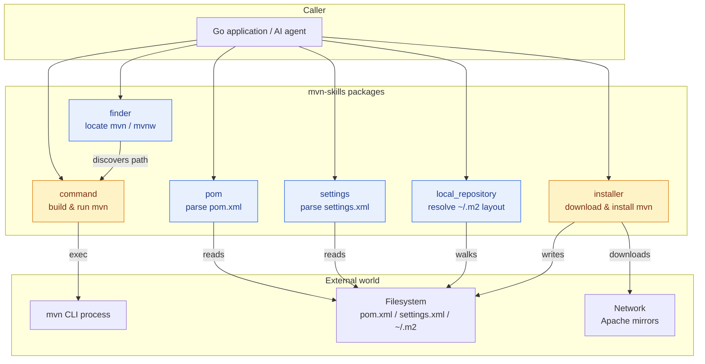

Blue packages are **pure / side-effect free** — trivially unit-testable.
Amber packages (`command`, `installer`) perform **I/O** and are exercised with
mocked processes and HTTP test servers.

## Package Dependency Graph

Internal dependencies are intentionally shallow — there are no cycles, and the
leaf packages depend on nothing but the standard library.

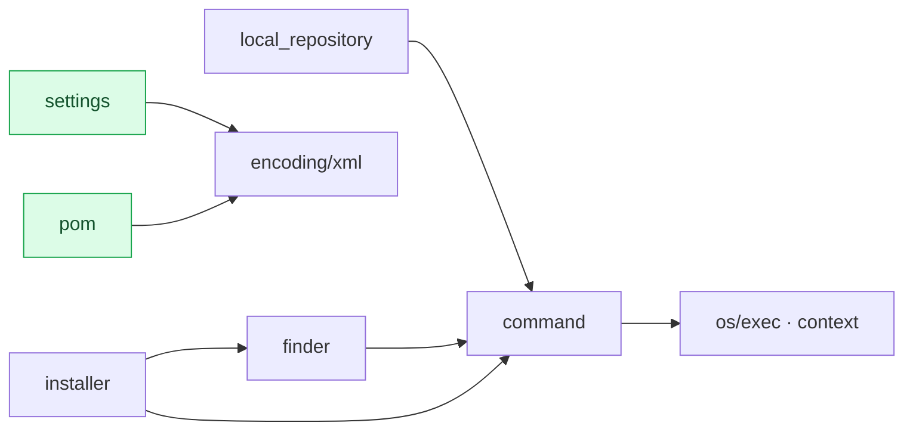

| Package | Depends on | Side effects |
|---------|-----------|--------------|
| `finder` | `command` (version check) | reads `PATH`, `M2_HOME`, filesystem |
| `command` | stdlib only | spawns `mvn` |
| `pom` | `encoding/xml` | none (pure) |
| `settings` | `encoding/xml` | none (pure) |
| `local_repository` | `command` | reads `~/.m2` |
| `installer` | `finder`, `command` | network, filesystem, env |

## Maven Resolution (finder)

`FindBestMaven` implements a **preference cascade**: a project-local Maven
Wrapper always wins over a system install, because the wrapper pins the exact
Maven version the project was built with.

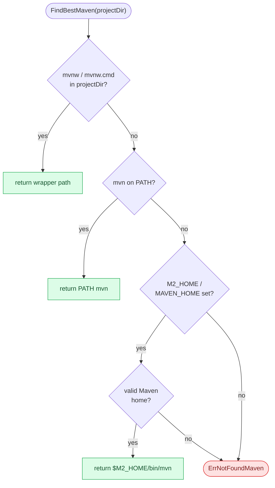

## Command Execution Pipeline

The `command` package turns a fluent builder into an `*exec.Cmd`, runs it, and
maps a non-zero exit into a structured `*MavenError` (never a bare string).

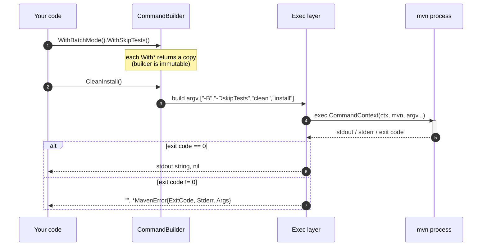

### Builder Immutability

Convenience methods (`Clean()`, `Install()`, …) do **not** mutate the receiver.
Each returns a fresh builder with the extra goal appended, so a single
configured builder can be reused for many commands without cross-talk.

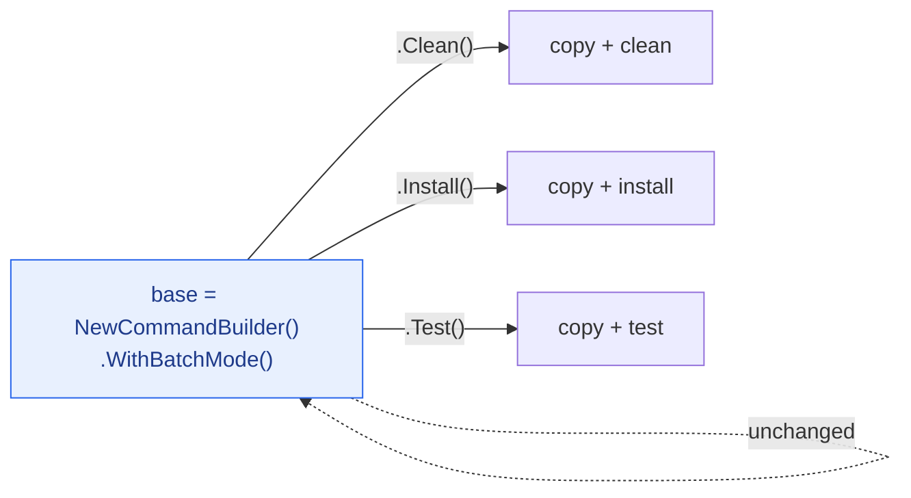

## Maven Build Lifecycle

The convenience methods map onto Maven's three built-in lifecycles. Running a
phase runs every phase before it in the same lifecycle.

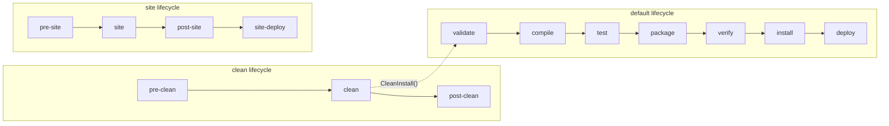

| SDK method | Effective command | Typical use |
|------------|-------------------|-------------|
| `Install(mvn)` | `mvn clean install` | local build + install to `~/.m2` |
| `CleanPackage()` | `mvn clean package` | produce artifact, skip install |
| `CleanDeploy()` | `mvn clean deploy` | publish to a remote repo |
| `Verify(mvn)` | `mvn verify` | run integration tests + checks |

## Installer: End-to-End Flow

`InstallWithOptions` is idempotent and platform-aware. It tries the cheapest
option first (an already-installed Maven), then a native package manager, and
only downloads a binary archive as a last resort.

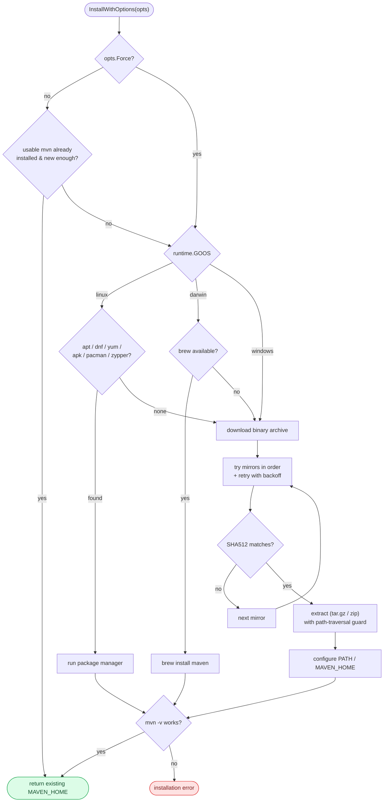

### Download with Mirror Fallback

Each mirror is retried with exponential backoff before moving on; a checksum
mismatch is treated like a failed download and advances to the next mirror.

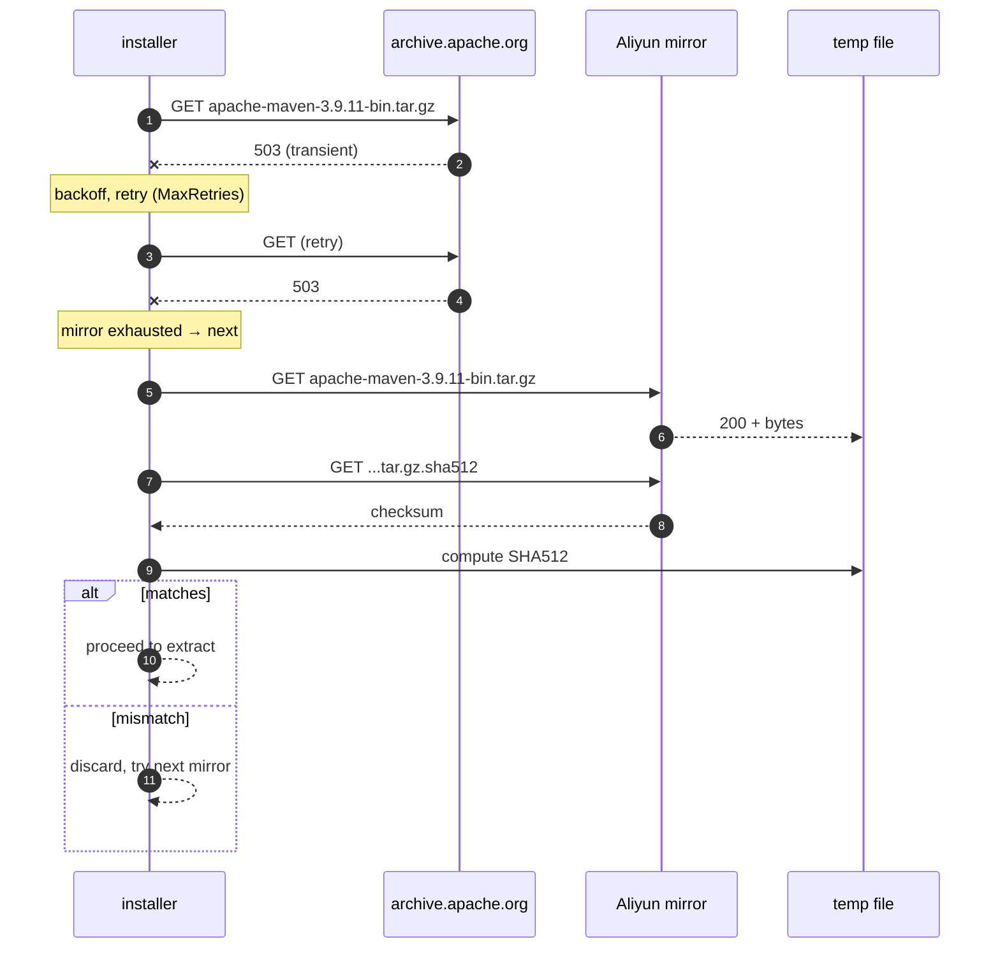

### Platform Environment Configuration

The three operating systems persist `MAVEN_HOME` and extend `PATH` very
differently. Windows is the tricky one: `setx PATH` truncates at 1024 chars, so
the installer reads the existing user `PATH` from the registry and appends
safely, degrading to a printed hint rather than corrupting `PATH`.

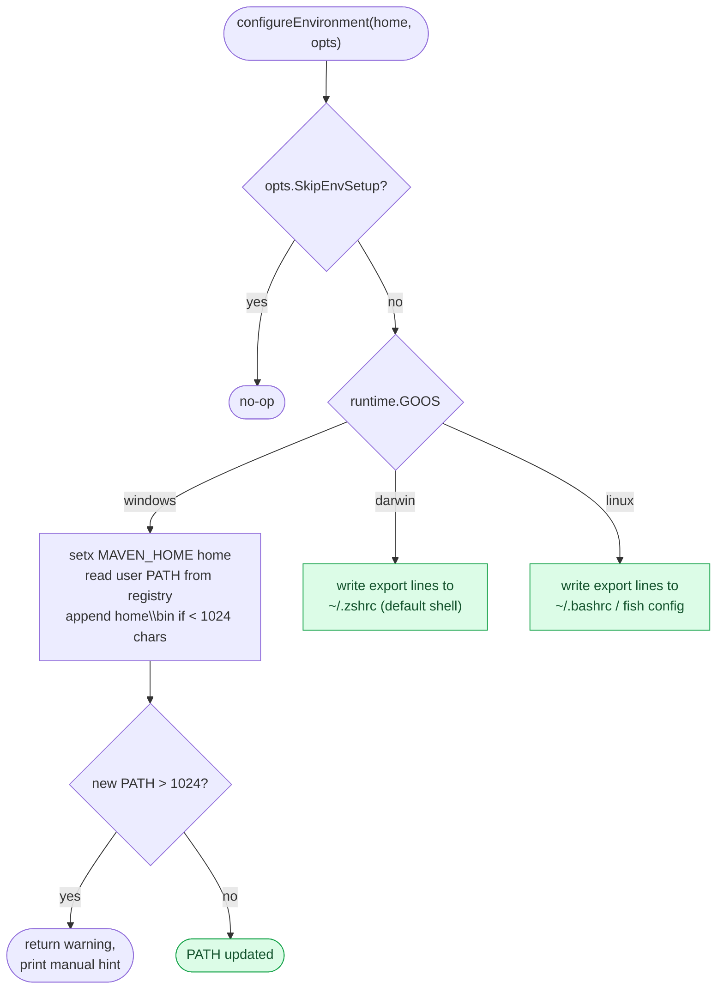

## POM Object Model

`pom.ParseFile` deserializes `pom.xml` into a `Project` tree. The accessor
methods (`GetGAV`, `GetDependencies`, …) provide null-safe reads with sensible
defaults (e.g. packaging defaults to `jar`).

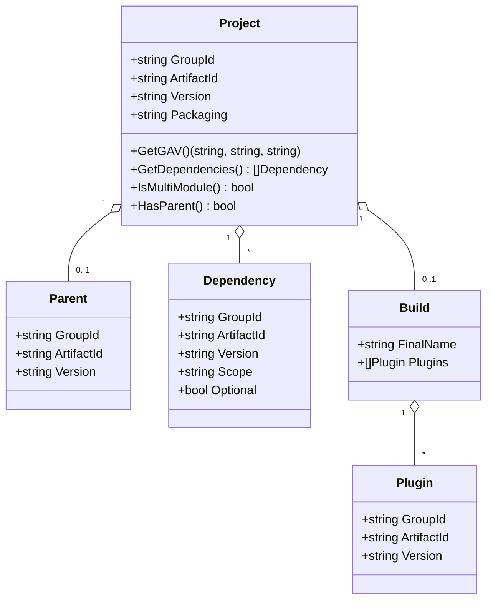

## Local Repository Layout

`local_repository` maps a Maven coordinate (GAV) onto its on-disk path inside
`~/.m2/repository`, mirroring Maven's own directory convention.

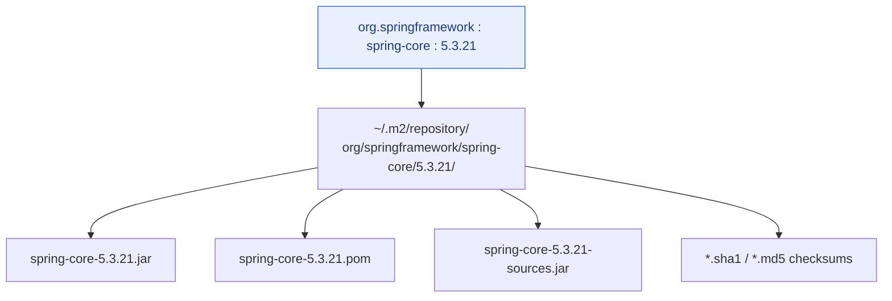

The group id `org.springframework` becomes the nested directory
`org/springframework` — each dot is a path separator.

## Where to Next

- [API Reference](/api) — the full function surface, with per-package diagrams
- [Getting Started](/) — install and first build
