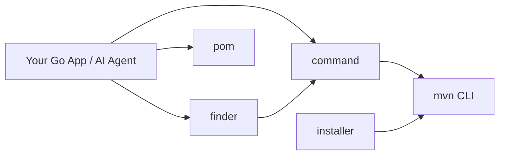

# Maven SDK Go

A Go SDK for Maven operations.

## Architecture at a Glance



## Features

- 🔍 **Finder**: Find JAR files in Maven local repository
- ⚡ **Command**: Execute Maven commands
- 📦 **Local Repository**: Parse Maven local repository structure
- 🚀 **Installer**: Automatically install Maven

## Quick Start

### Installation

```bash
go get github.com/scagogogo/mvn-skills
```

### Basic Usage

```go
package main

import (
    "fmt"
    "github.com/scagogogo/mvn-skills/pkg/finder"
)

func main() {
    // Find JAR file
    jarPath, err := finder.FindJar("org.example", "example-artifact", "1.0.0")
    if err != nil {
        panic(err)
    }
    fmt.Printf("Found JAR: %s\n", jarPath)
}
```

## Documentation

- [Architecture](/architecture) - How the packages fit together, with flow diagrams
- [API Reference](/api) - Detailed API documentation
- [Examples](https://github.com/scagogogo/mvn-skills/tree/main/examples) - Code examples

## License

Released under the [MIT](https://opensource.org/licenses/MIT) License.