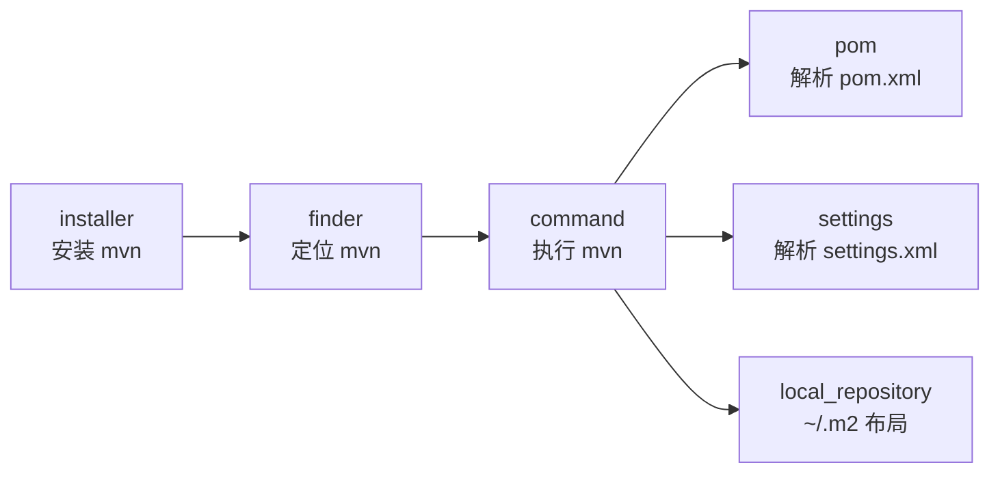
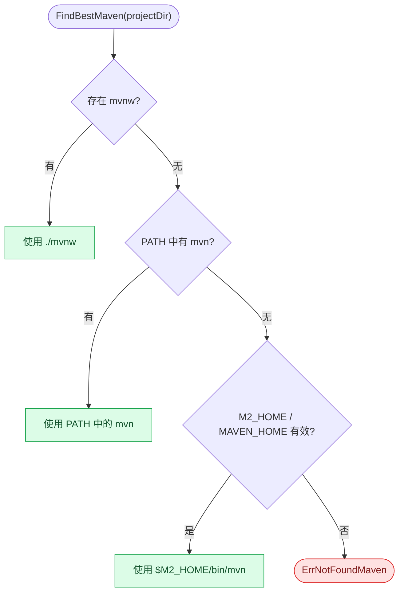
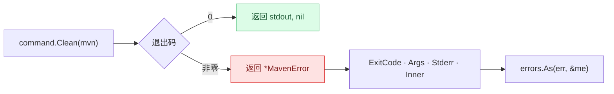
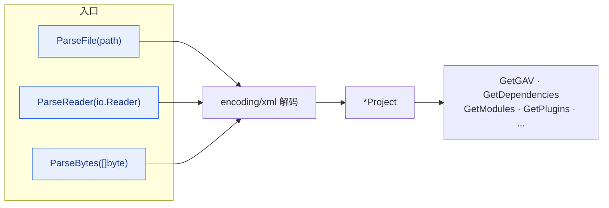
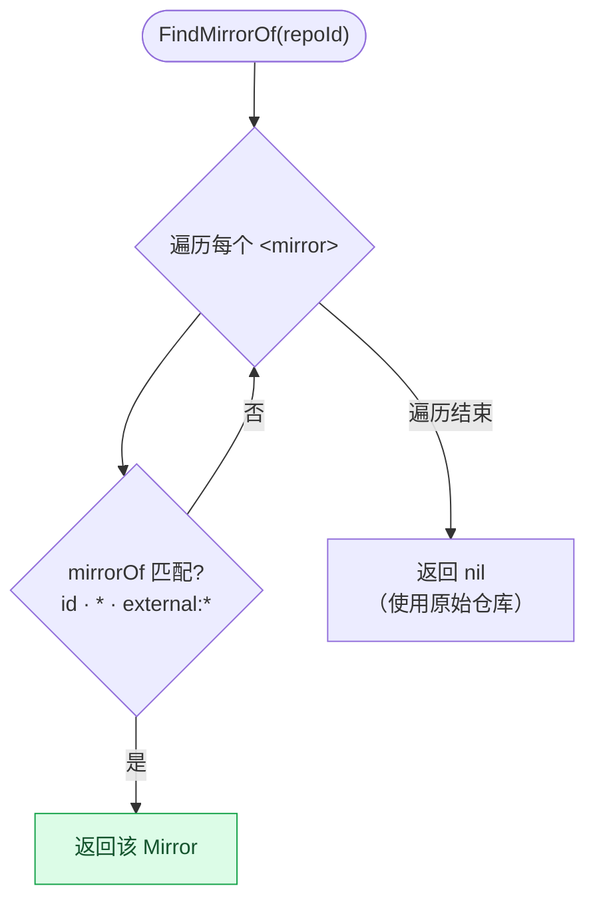
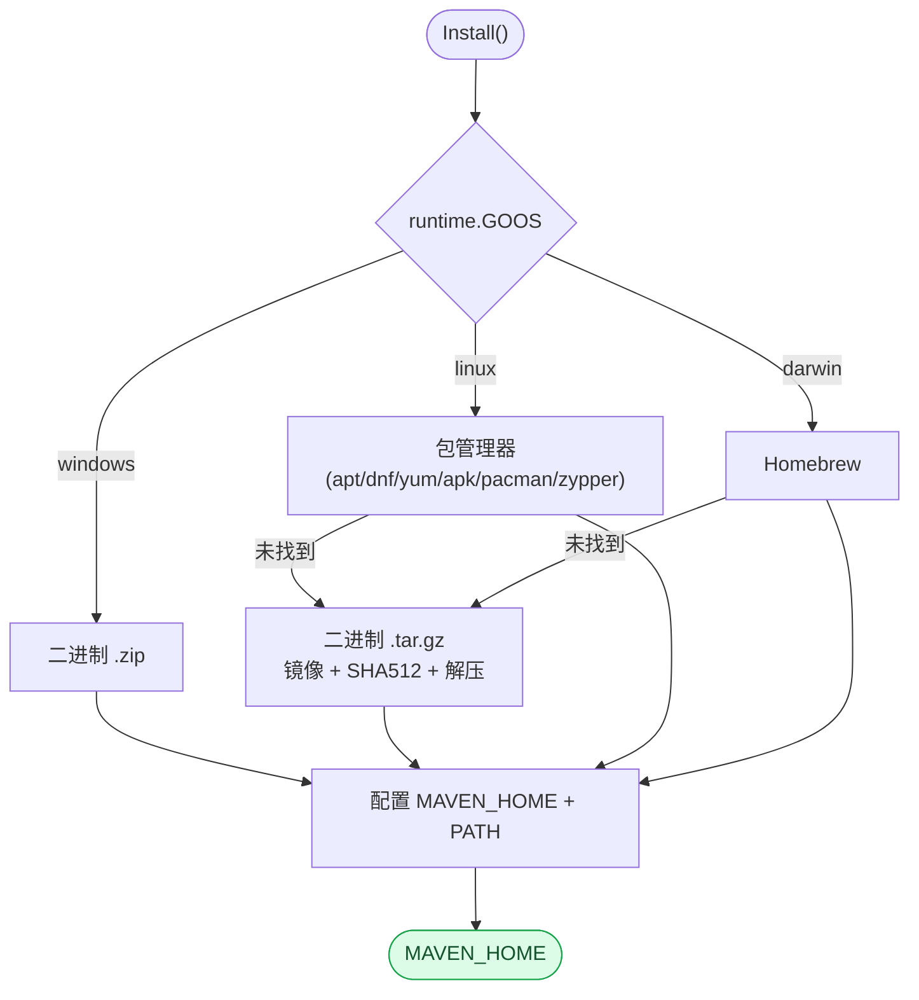

# API 参考

本文档提供了 Maven SDK Go 的详细 API 参考。如果想了解全局视角——各模块如何
交互、一次构建请求如何在系统中流转——请参阅[架构设计](/zh/architecture)。

## 模块地图



## 包概览

### Finder

Finder 包用于查找 Maven 可执行文件，包括系统安装的 Maven 和 Maven Wrapper。

```go
package finder

// FindMaven 查找本机已安装的 Maven（PATH / M2_HOME / MAVEN_HOME）
func FindMaven() (string, error)

// Check 检查给定目录是否包含有效的 Maven 安装
func Check(mavenHomeDirectory string) bool

// FindMavenWrapper 在项目目录中查找 Maven Wrapper（mvnw/mvnw.cmd）
func FindMavenWrapper(projectDir string) (string, error)

// FindBestMaven 查找最合适的 Maven：优先使用项目 Wrapper，否则回退到系统 Maven
func FindBestMaven(projectDir string) (string, error)

// HasMavenWrapper 检查项目目录中是否存在 Maven Wrapper
func HasMavenWrapper(projectDir string) bool

var ErrNotFoundMaven error
var ErrNotFoundMavenWrapper error
```

`FindBestMaven` 使用的**解析顺序**——优先项目 Wrapper，因为它锁定了项目
期望的确切 Maven 版本：



### Command

Command 包提供了全面的 Maven 命令执行功能。

#### 命令构建器（推荐）

构建器模式提供流式、可组合的 API 来构建 Maven 命令：

```go
package command

// 创建带常用 CI 设置的构建器
output, err := NewCommandBuilder().
    WithExecutable("mvn").
    WithWorkingDirectory("/path/to/project").
    WithBatchMode().           // -B：非交互模式，CI 必需
    WithNoTransferProgress().  // -ntp：更干净的 CI 日志
    WithProfiles("ci").        // -P ci
    WithSkipTests().           // -DskipTests
    WithUpdateSnapshots().     // -U
    Clean()                    // 执行 "mvn -B -ntp -P ci -DskipTests -U clean"
```

**构建器选项：**

| 方法 | CLI 标志 | 说明 |
|------|---------|------|
| `WithExecutable(path)` | — | 设置 mvn 可执行文件路径 |
| `WithWorkingDirectory(dir)` | — | 设置工作目录 |
| `WithPomFile(path)` | `-f` | 指定 POM 文件 |
| `WithSettingsFile(path)` | `-s` | 指定用户 settings.xml |
| `WithGlobalSettings(path)` | `-gs` | 指定全局 settings.xml |
| `WithToolchains(path)` | `-t` | 指定 toolchains 文件 |
| `WithProfiles(...)` | `-P` | 激活 Profile |
| `WithProperty(k, v)` | `-Dk=v` | 设置系统属性 |
| `WithProperties(map)` | `-Dk=v` | 批量设置属性 |
| `WithProjects(...)` | `-pl` | 构建指定模块 |
| `WithAlsoMake()` | `-am` | 同时构建依赖模块 |
| `WithAlsoMakeDependents()` | `-amd` | 同时构建被依赖模块 |
| `WithOffline()` | `-o` | 离线模式 |
| `WithBatchMode()` | `-B` | 非交互/批处理模式 |
| `WithUpdateSnapshots()` | `-U` | 强制更新 SNAPSHOT |
| `WithSkipTests()` | `-DskipTests` | 跳过测试执行 |
| `WithSkipTestsCompletely()` | `-Dmaven.test.skip=true` | 完全跳过测试 |
| `WithErrors()` | `-e` | 显示完整错误堆栈 |
| `WithDebug()` | `-X` | 调试输出 |
| `WithQuiet()` | `-q` | 安静模式 |
| `WithThreads(n)` | `-T n` | 并行构建 |
| `WithNonRecursive()` | `-N` | 不递归构建子模块 |
| `WithResumeFrom(module)` | `-rf` | 从指定模块恢复构建 |
| `WithFailAtEnd()` | `-fae` | 失败时继续，最后报错 |
| `WithFailNever()` | `-fn` | 永不报错 |
| `WithFailFast()` | `-ff` | 快速失败（默认行为） |
| `WithNoTransferProgress()` | `-ntp` | 不显示下载进度 |
| `WithStrictChecksums()` | `-C` | 校验和不匹配则失败 |
| `WithLaxChecksums()` | `-c` | 校验和不匹配则警告 |
| `WithShowVersion()` | `-V` | 显示版本但不停止 |

**构建器便捷方法：** `Clean()`, `Compile()`, `Test()`, `Package()`, `Install()`, `Deploy()`, `Verify()`

> **不可变性：** 便捷方法不会修改原始 builder。每次调用创建一个副本并添加目标，
> 原始 builder 保持可重用。

#### 错误处理

每次失败都会以类型化的 `*MavenError` 暴露，携带退出码、完整 argv 和 Maven 的
stderr——调用方可以据此按退出码分支处理，而不必去 grep 字符串。



```go
// MavenError 表示 Maven 命令执行失败
type MavenError struct {
    Command   string   // 完整命令（如 "mvn clean install"）
    Args      []string // 命令参数
    Stderr    string   // Maven 的 stderr 输出（截断至 500 字符）
    ExitCode  int      // 进程退出码（如果可用）
    Inner     error    // 原始错误
}

// ExecForStdout 失败时返回 *MavenError，包含 stderr 内容
output, err := command.Clean("mvn")
if err != nil {
    var me *command.MavenError
    if errors.As(err, &me) {
        log.Printf("Maven stderr: %s", me.Stderr)
    }
}
```

#### 通用执行

```go
type Options struct {
    Executable       string
    Args             []string
    WorkingDirectory string
    Stdin            io.Reader
    Stdout           io.Writer
    Stderr           io.Writer
}

func Exec(options *Options) error
func ExecForStdout(executable string, args ...string) (string, error)
func BuildExecutable(mavenHomeDirectory string) string
```

#### 生命周期阶段

调用某个阶段会执行**它以及同一生命周期中它之前的所有阶段**。下面这些函数是
对 `mvn <phase>` 的轻量封装。


```go
// 常用阶段
func Clean(executable string) (string, error)          // mvn clean
func Compile(executable string) (string, error)         // mvn compile
func Test(executable string) (string, error)            // mvn test
func TestCompile(executable string) (string, error)     // mvn test-compile
func Package(executable string) (string, error)         // mvn package
func Verify(executable string) (string, error)          // mvn verify
func Deploy(executable string) (string, error)          // mvn deploy
func Site(executable string) (string, error)            // mvn site
func Validate(executable string) (string, error)        // mvn validate
func Install(executable string) (string, error)         // mvn clean install
func StandaloneInstall(executable string) (string, error) // mvn install（不带 clean）

// 扩展阶段
func Initialize(executable string) (string, error)           // mvn initialize
func GenerateSources(executable string) (string, error)      // mvn generate-sources
func ProcessResources(executable string) (string, error)     // mvn process-resources
func PreparePackage(executable string) (string, error)       // mvn prepare-package
func PreIntegrationTest(executable string) (string, error)   // mvn pre-integration-test
func IntegrationTest(executable string) (string, error)      // mvn integration-test
func PostIntegrationTest(executable string) (string, error)  // mvn post-integration-test
func PreClean(executable string) (string, error)             // mvn pre-clean
func PostClean(executable string) (string, error)            // mvn post-clean
func PreSite(executable string) (string, error)              // mvn pre-site
func PostSite(executable string) (string, error)             // mvn post-site
func SiteDeploy(executable string) (string, error)           // mvn site-deploy
```

#### 依赖命令

```go
func DependencyGet(executable, groupId, artifactId, version string) (string, error)
func DependencyTree(executable string) (string, error)
func DependencyResolve(executable string) (string, error)
func DependencyAnalyze(executable string) (string, error)
func DependencyList(executable string) (string, error)
func DependencyPurgeLocalRepository(executable string) (string, error)
func DependencyCopy(executable, gid, aid, ver, outputDir string) (string, error)
func DependencyCopyDependencies(executable, outputDir string) (string, error)
func DependencyUnpack(executable, gid, aid, ver, outputDir string) (string, error)
func DependencyBuildClasspath(executable string) (string, error)
```

#### 测试插件

```go
// Surefire（单元测试）
func SurefireTest(executable string) (string, error)
func SurefireTestSingleClass(executable, className string) (string, error)
func SurefireTestMethod(executable, methodSpec string) (string, error)

// Failsafe（集成测试）
func FailsafeIntegrationTest(executable string) (string, error)
func FailsafeVerify(executable string) (string, error)
```

#### 版本管理

```go
func VersionsSet(executable, newVersion string) (string, error)
func VersionsCommit(executable string) (string, error)
func VersionsRevert(executable string) (string, error)
func VersionsDisplayDependencyUpdates(executable string) (string, error)
func VersionsDisplayPluginUpdates(executable string) (string, error)
func VersionsUseLatestReleases(executable string) (string, error)
func VersionsUseNextReleases(executable string) (string, error)
```

#### 发布

```go
func ReleasePrepare(executable string) (string, error)
func ReleasePrepareWithArgs(executable string, args ...string) (string, error)
func ReleasePerform(executable string) (string, error)
func ReleaseRollback(executable string) (string, error)
func ReleaseClean(executable string) (string, error)
```

#### 构件打包与发布

```go
func JarJar(executable string) (string, error)
func SourceJar(executable string) (string, error)
func SourceJarNoFork(executable string) (string, error)
func JavadocJavadoc(executable string) (string, error)
func JavadocJar(executable string) (string, error)
func InstallJar(executable, jarPath, gid, aid, ver string) (string, error)
func DeployDeploy(executable string) (string, error)
func DeployDeployFile(executable, file, gid, aid, ver, repoId, url string) (string, error)
func GpgSign(executable string) (string, error)
```

#### 构建工具

```go
func AssemblySingle(executable string) (string, error)
func ShadeShade(executable string) (string, error)
func ExecJava(executable string) (string, error)
func ExecJavaWithMainClass(executable, mainClass string) (string, error)
func ExecExec(executable string) (string, error)
func EnforcerEnforce(executable string) (string, error)
func ArchetypeCreate(executable, dir, gid, aid, ver string) (string, error)
func Wrapper(executable string) (string, error)
```

### POM 解析器

POM 包解析 Maven pom.xml 文件为类型化的 Go 结构体。三个入口最终汇入同一个
XML 解码器，因此无论你从路径、reader 还是字节切片开始，行为都完全一致。



完整的 `Project` 对象模型类图见[架构设计](/zh/architecture#pom-对象模型)。

```go
package pom

func ParseFile(path string) (*Project, error)
func ParseReader(r io.Reader) (*Project, error)
func ParseBytes(data []byte) (*Project, error)

// Project 方法
func (p *Project) GetGAV() (groupId, artifactId, version string)
func (p *Project) GetDependencies() []Dependency
func (p *Project) GetModules() []string
func (p *Project) GetPlugins() []Plugin
func (p *Project) GetProfiles() []Profile
func (p *Project) GetRepositories() []Repository
func (p *Project) GetProperties() map[string]string
func (p *Project) GetLicenses() []License
func (p *Project) GetDevelopers() []Developer
func (p *Project) GetScm() *Scm
func (p *Project) GetBuild() *Build
func (p *Project) GetPackaging() string  // 未指定时默认为 "jar"
func (p *Project) GetProfiles() []Profile
func (p *Project) GetRepositories() []Repository
func (p *Project) IsMultiModule() bool
func (p *Project) HasParent() bool
func (p *Project) FindDependency(groupId, artifactId string) *Dependency
func (p *Project) FindPlugin(groupId, artifactId string) *Plugin
```

**核心类型：** `Project`, `Parent`, `Dependency`, `Plugin`, `Profile`, `Repository`, `Build`, `Scm`, `License`, `Developer`

### Settings 解析器

Settings 包解析 Maven settings.xml 文件。`FindMirrorOf` 实现了 Maven 的镜像
匹配规则，包括 `*` 和 `external:*` 通配符。



```go
package settings

func ParseFile(path string) (*Settings, error)
func ParseReader(r io.Reader) (*Settings, error)
func ParseBytes(data []byte) (*Settings, error)
func ParseDefault() (*Settings, error)   // 解析 ~/.m2/settings.xml 或 ${M2_HOME}/conf/settings.xml

func GetDefaultSettingsPath() string     // 返回 ~/.m2/settings.xml 路径

// Settings 方法
func (s *Settings) GetMirrors() []Mirror
func (s *Settings) GetServers() []Server
func (s *Settings) GetProxies() []Proxy
func (s *Settings) GetProfiles() []SettingsProfile
func (s *Settings) GetActiveProfileIds() []string
func (s *Settings) GetPluginGroups() []string
func (s *Settings) GetLocalRepository() string
func (s *Settings) IsOffline() bool
func (s *Settings) FindServer(id string) *Server
func (s *Settings) FindMirror(id string) *Mirror
func (s *Settings) FindMirrorOf(repositoryId string) *Mirror
func (s *Settings) FindActiveProxy() *Proxy
func (s *Settings) FindProfile(id string) *SettingsProfile
```

**核心类型：** `Settings`, `Server`, `Mirror`, `Proxy`, `SettingsProfile`, `SettingsActivation`

### Local Repository

```go
package local_repository

var DefaultLocalRepositoryDirectory string  // ~/.m2/repository/

func ParseLocalRepositoryDirectory(executable string) string
func BuildDirectory(groupId, artifactId, version string) string
func FindDirectory(repoDir, groupId, artifactId, version string) (string, error)
func FindJar(repoDir, groupId, artifactId, version string) (string, error)
func FindJarWithClassifier(repoDir, groupId, artifactId, version, classifier string) (string, error)
```

### Installer

`Install()` 会自动检测平台并挑选成本最低的可行方案；`InstallWithOptions`
则暴露版本锁定、自定义镜像、校验和控制与幂等性覆盖等选项。完整流程、镜像
回退时序以及各操作系统的环境处理见[架构设计](/zh/architecture#安装器-端到端流程)。



```go
package installer

// 高层入口
func Install() (string, error)              // 自动检测平台，幂等
func InstallLinux() (string, error)         // apt/dnf/yum/apk/pacman/zypper 或二进制包
func InstallMacOS() (string, error)         // Homebrew 或二进制包
func InstallWindows() (string, error)       // zip + 安全的 PATH/MAVEN_HOME 配置

// 可配置入口
func InstallWithOptions(opts InstallOptions) (string, error)
func DefaultInstallOptions() InstallOptions
func InstallMacOSWithOptions(opts InstallOptions) (string, error) // 旧别名

// 选项
type InstallOptions struct {
    Version      string   // "" → DefaultMavenVersion
    Mirrors      []string // "" → DefaultMirrors（Apache + 阿里云 + 清华）
    HomeDir      string   // 安装目标目录（默认按操作系统区分）
    SkipEnvSetup bool     // 不修改 PATH / shell 配置
    SkipChecksum bool     // 跳过 SHA512 校验（不推荐）
    Force        bool     // 即使已存在可用 Maven 也强制重装
    MaxRetries   int      // 每个镜像的下载重试次数（默认 3）
}

const DefaultMavenVersion = "3.9.11"
var DefaultMirrors []string
```

## 使用示例

### CI/CD 构建（构建器模式）

```go
output, err := command.NewCommandBuilder().
    WithExecutable("mvn").
    WithWorkingDirectory("/workspace/project").
    WithBatchMode().
    WithNoTransferProgress().
    WithProfiles("ci").
    WithSkipTests().
    WithUpdateSnapshots().
    Clean()
```

### 多模块构建

```go
output, err := command.NewCommandBuilder().
    WithProjects("module-a", "module-b").
    WithAlsoMake().
    WithBatchMode().
    Install()
```

### 运行单个测试

```go
maven, _ := finder.FindMaven()
output, err := command.SurefireTestSingleClass(maven, "com.example.UserServiceTest")
```

### 解析 POM 文件

```go
project, err := pom.ParseFile("pom.xml")
if err != nil {
    log.Fatal(err)
}
groupId, artifactId, version := project.GetGAV()
fmt.Printf("项目: %s:%s:%s\n", groupId, artifactId, version)

for _, dep := range project.GetDependencies() {
    fmt.Printf("  %s:%s:%s (%s)\n", dep.GroupId, dep.ArtifactId, dep.Version, dep.Scope)
}
```

### 解析 settings.xml

```go
settings, err := settings.ParseDefault()
if err != nil {
    log.Fatal(err)
}
for _, mirror := range settings.GetMirrors() {
    fmt.Printf("镜像 %s: %s -> %s\n", mirror.Id, mirror.MirrorOf, mirror.URL)
}
```

### 查找带 Classifier 的 JAR

```go
maven, _ := finder.FindMaven()
repoDir := local_repository.ParseLocalRepositoryDirectory(maven)
sources, _ := local_repository.FindJarWithClassifier(repoDir, "org.springframework", "spring-core", "5.3.21", "sources")
```

### 版本管理

```go
maven, _ := finder.FindMaven()
output, err := command.VersionsSet(maven, "2.0.0")
// 确认无误后提交：
output, err = command.VersionsCommit(maven)
// 或者发现问题则回滚：
// output, err = command.VersionsRevert(maven)
```

### Maven Wrapper 检测

```go
// 优先使用项目 Wrapper 而非系统 Maven
maven, err := finder.FindBestMaven("/path/to/project")
if err != nil {
    log.Fatal(err)
}
output, _ := command.Compile(maven)
```
