# 架构设计

本页解释 **Maven SDK Go** 各部分如何协同工作，以及一次请求如何从你的代码
一路流向 `mvn` 进程再返回。下面每张图都由本页内嵌的 Mermaid 源码渲染而成。

## 系统上下文

在最上层，你的应用（或 AI 智能体）与一组职责单一的小模块交互。只有
`command` 与 `installer` 会触碰外部世界（`mvn` 进程、网络、文件系统）；其余
都是纯 Go 代码，只对路径、XML 和字符串做处理。

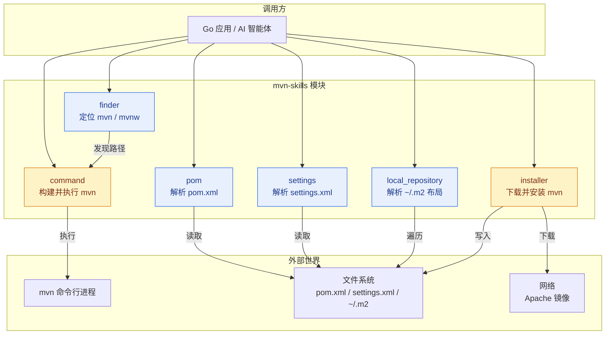

蓝色模块是**纯函数 / 无副作用**的，易于单元测试。琥珀色模块
（`command`、`installer`）会执行 **I/O**，测试时用 mock 进程和 HTTP 测试
服务器覆盖。

## 模块依赖图

内部依赖刻意保持很浅——没有循环依赖，叶子模块只依赖标准库。

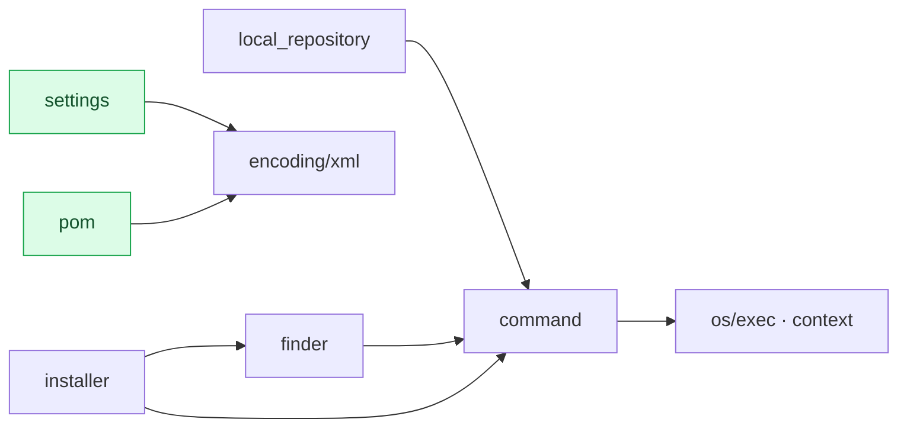

| 模块 | 依赖 | 副作用 |
|------|------|--------|
| `finder` | `command`（版本检查） | 读取 `PATH`、`M2_HOME`、文件系统 |
| `command` | 仅标准库 | 启动 `mvn` 进程 |
| `pom` | `encoding/xml` | 无（纯函数） |
| `settings` | `encoding/xml` | 无（纯函数） |
| `local_repository` | `command` | 读取 `~/.m2` |
| `installer` | `finder`、`command` | 网络、文件系统、环境变量 |

## Maven 定位（finder）

`FindBestMaven` 实现了一条**优先级级联**：项目自带的 Maven Wrapper 永远
优先于系统安装，因为 Wrapper 锁定了项目构建时所用的确切 Maven 版本。

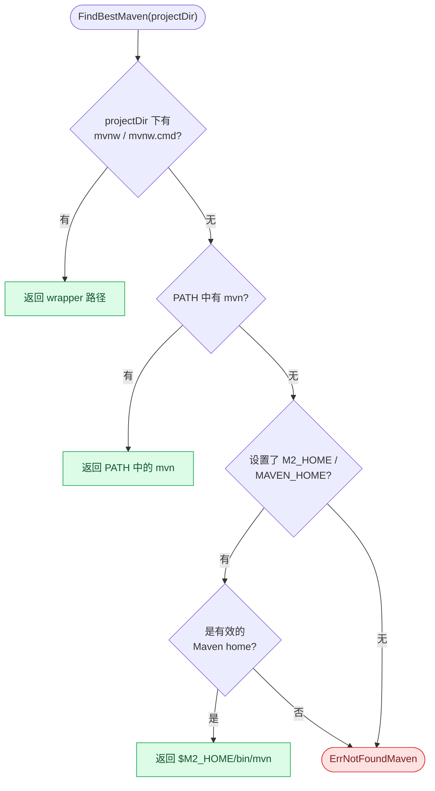

## 命令执行流水线

`command` 模块把流式构建器转换为 `*exec.Cmd`，执行它，并把非零退出码映射为
结构化的 `*MavenError`（而非裸字符串）。

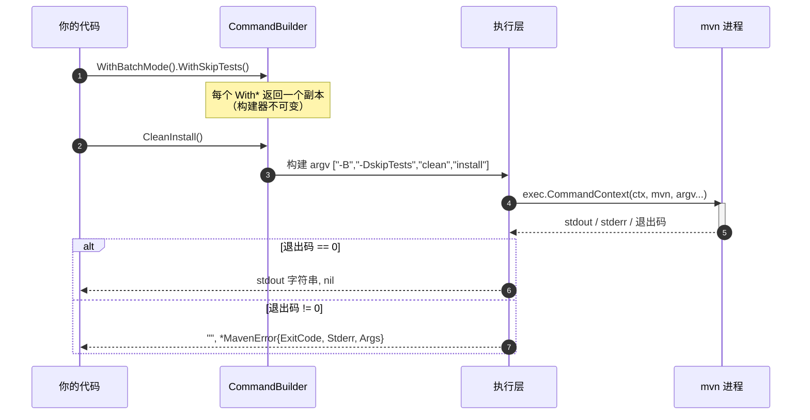

### 构建器的不可变性

便捷方法（`Clean()`、`Install()`……）**不会**修改接收者本身。每次调用都
返回一个追加了目标的全新构建器，因此一个已配置好的构建器可以被复用来执行
多条命令而互不干扰。

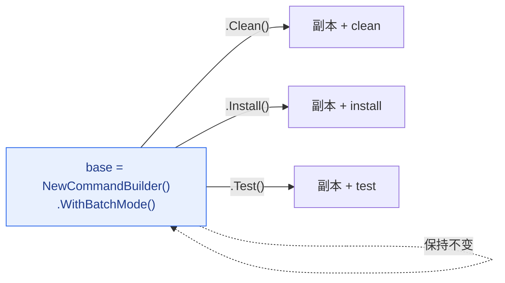

## Maven 构建生命周期

便捷方法映射到 Maven 内置的三条生命周期。执行某个阶段会连带执行同一条
生命周期中它之前的所有阶段。

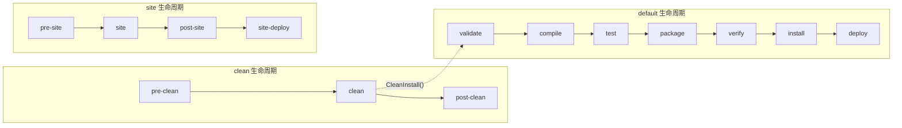

| SDK 方法 | 实际命令 | 典型用途 |
|----------|----------|----------|
| `Install(mvn)` | `mvn clean install` | 本地构建并安装到 `~/.m2` |
| `CleanPackage()` | `mvn clean package` | 产出构件，不安装 |
| `CleanDeploy()` | `mvn clean deploy` | 发布到远程仓库 |
| `Verify(mvn)` | `mvn verify` | 运行集成测试与检查 |

## 安装器：端到端流程

`InstallWithOptions` 具备幂等性且感知平台。它优先尝试成本最低的方案（已经
安装好的 Maven），再尝试原生包管理器，只有在万不得已时才下载二进制归档。

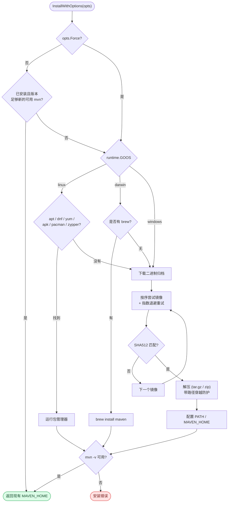

### 带镜像回退的下载

每个镜像会以指数退避重试若干次后再切换；校验和不匹配被视作一次失败下载，
同样触发切换到下一个镜像。

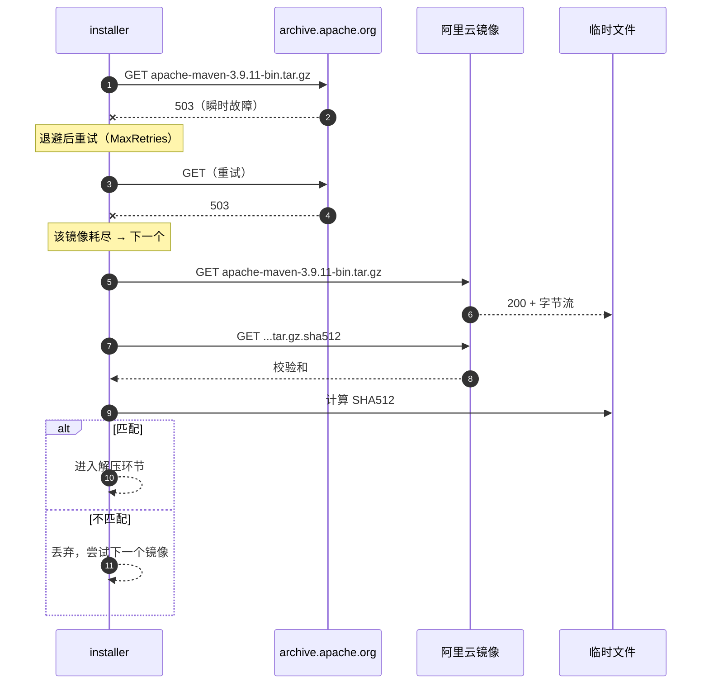

### 各平台环境变量配置

三种操作系统持久化 `MAVEN_HOME` 和扩展 `PATH` 的方式差异很大。Windows 最
棘手：`setx PATH` 会在 1024 字符处截断，因此安装器从注册表读取现有的用户
`PATH` 再安全地追加，若超长则降级为打印提示而不是破坏 `PATH`。

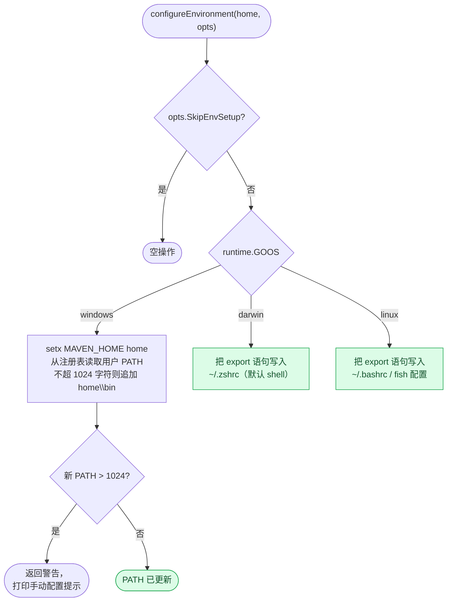

## POM 对象模型

`pom.ParseFile` 把 `pom.xml` 反序列化为 `Project` 树。访问器方法
（`GetGAV`、`GetDependencies`……）提供空安全读取并带有合理默认值
（例如 packaging 默认为 `jar`）。

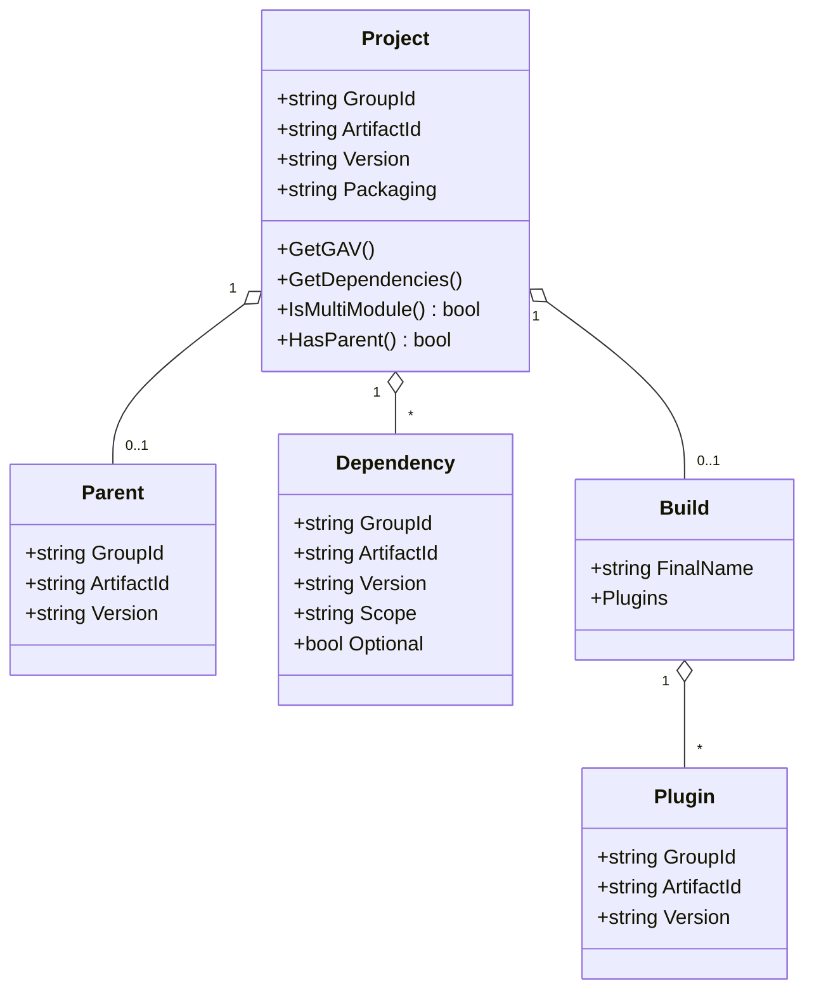

## 本地仓库布局

`local_repository` 把一个 Maven 坐标（GAV）映射到它在 `~/.m2/repository`
下的磁盘路径，与 Maven 自身的目录约定一致。

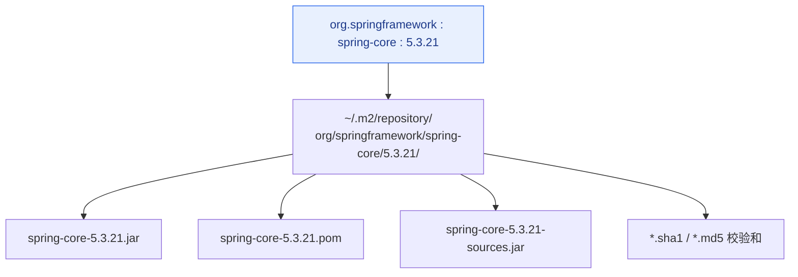

group id `org.springframework` 会变成嵌套目录 `org/springframework`——每个
点号都是一个路径分隔符。

## 下一步

- [API 参考](/zh/api) —— 完整的函数接口，含各模块示意图
- [快速开始](/zh/) —— 安装与首次构建
