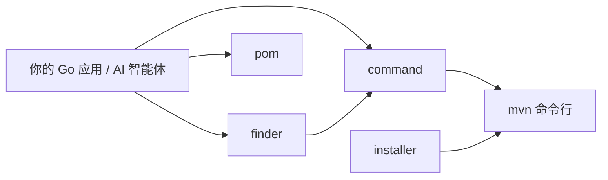

# Maven SDK Go

一个用于 Maven 操作的 Go 语言 SDK。

## 架构总览



## 特性

- 🔍 **Finder**: 查找 Maven 本地仓库中的 JAR 文件
- ⚡ **Command**: 执行 Maven 命令
- 📦 **Local Repository**: 解析 Maven 本地仓库结构
- 🚀 **Installer**: 自动安装 Maven

## 快速开始

### 安装

```bash
go get github.com/scagogogo/mvn-skills
```

### 基本使用

```go
package main

import (
    "fmt"
    "github.com/scagogogo/mvn-skills/pkg/finder"
)

func main() {
    // 查找 JAR 文件
    jarPath, err := finder.FindJar("org.example", "example-artifact", "1.0.0")
    if err != nil {
        panic(err)
    }
    fmt.Printf("找到 JAR: %s\n", jarPath)
}
```

## 文档

- [架构设计](/zh/architecture) - 各模块如何协作，配以流程图
- [API 参考](/zh/api) - 详细的 API 文档
- [示例](https://github.com/scagogogo/mvn-skills/tree/main/examples) - 代码示例

## 许可证

基于 [MIT](https://opensource.org/licenses/MIT) 许可证发布。